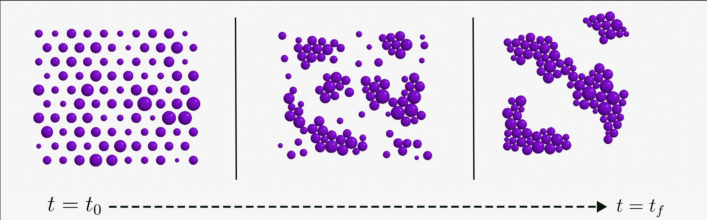
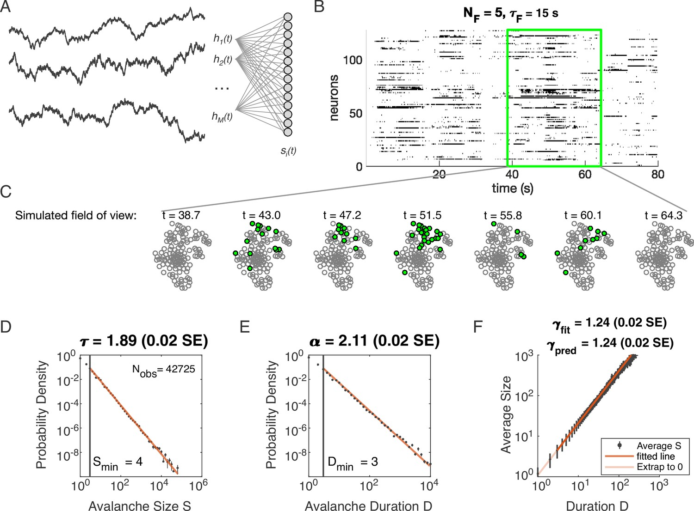

Hi! I'm a graduate student at NYU physics. I enjoy studying complex systems with a theoretical, computational, and experimental tools. 

I'm especially interested in the dynamics of systems driven by external processes. So far, I have explained firing statistics in large populations of neurons and wave-mediated interparticle forces in optics and acoustics. 

You can find my publications [here](https://scholar.google.com/citations?hl=en&view_op=list_works&gmla=ALUCkoXSqLiTMH4c-FjLktiIgAp_6KPM1j_hSbOuxuOfHWQoddZlfqSHF72m3EkA6DuyW7PUXVzvS3z1oMb-OAbEHYpF&user=ArLaWlsAAAAJ) and my CV [here](./cv.html).

# Wave-mediated forces

Waves can exert forces on particles which scatter them. When the wavelength is greater than the scatterer radius, these forces can be strong enough to levitate particles against gravity. I have used wave-mediated forces to [design novel mass and force measurement technologies](https://link.aps.org/doi/10.1103/PhysRevE.108.064903) and  

Sound waves and light waves can mediate interactions between particles, which emerge from the interference of their scattered waves. I have analytically calculated [novel interaction forces between nonidentical particles immersed in sound and light waves](https://arxiv.org/abs/2404.17410). These forces are nonreciprocal: the force on particle i due to particle j is not equal to the force on particle j due to particle i. 

# Emergent activity

Active particles consume energy to power their motion, which can generate nonreciprocal interactions. When a predator runs towards prey, for example, there is an apparent nonreciprocal interaction between them: the predator is attracted to the prey, but the prey is repelled by the predator. 

Nonreciprocal interactions can also emerge between inert particles when they interact with and modify an external field. I have named this class of active materials built from passive components [***emergent active matter***](https://arxiv.org/abs/2404.17410). Catalytic colloids, dusty plasmas, and wave-matter composites are examples of emergent active systems. While the particular nonreciprocal interactions in these systems may vary in sign and form, emergent active particles consume energy analogously. Unifying these disparate systems under one class is useful for further study of emergent active systems. 

Interestingly, emergent activity was available before the origin of biology. Water wave mediated forces therefore may have played a role in the origin of life. Perhaps life may still exploit water wave mediated forces to perform work on its environment! 

# The Dynamic Latent Variable Model

The Dynamic Latent Variable Model consists of ***N*** discrete units which have 2 states: 0 or 1. Each unit is driven by at least one of a collection of time-varying fields. 

In collaboration with Ilya Nemenman and Audrey Sederberg, I have used the Dynamic Latent Variable Model to demonstrate that signatures of statistical mechanical criticality observed experimentally in large populations of neurons originate ***solely*** from the existence of the many time-varying signals that drive the brain. 

Through groundbreaking techniques, experimentalists can now record thousands of neurons' activity simultaneously. Upon analysis of  correlated clusters of neurons, [Meshulam et al.](https://link.aps.org/doi/10.1103/PhysRevLett.123.178103) found that firing statistics scale as power laws of neural cluster size, a signature of criticality. Using our Dynamic Latent Variable Model, we explain that these power laws emerge in any sufficiently large system driven by time-varying processes [here](https://link.aps.org/doi/10.1103/PhysRevLett.126.118302). We match experimental power laws within error bars! 

[Here](https://elifesciences.org/articles/89337), we show that the Dynamic Latent Variable Model can explain the avalanche, or crackling noise scaling, observed in the acivity of large neural populations. We also show that crackling noise scaling is not associated with optimal information transmission. This finding contradicts the ``critical brain hypothesis'': the theory that the brain is poised at statistical mechanical criticality.

In summary, we've found that statistical signatures associated with criticality emerge in the brain, but not for any deep reason.

