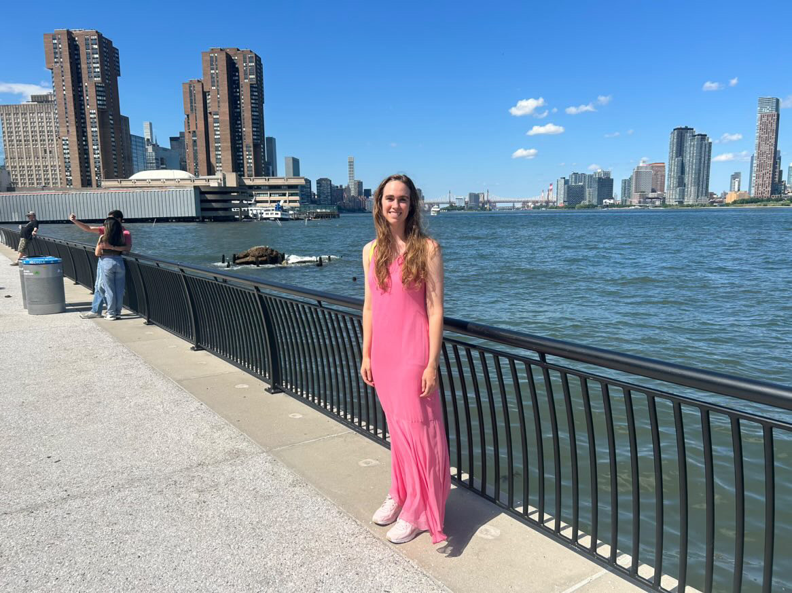

Hi! I'm a graduate student at NYU physics. I enjoy studying complex systems with a theoretical and computational tools. I'm especially interested in the dynamics of systems driven by external processes. During my exploration of complex systems, I have explained statistical signatures in large populations of neurons, and ... Read more about these projects below!

You can find my publications [here](https://scholar.google.com/citations?hl=en&view_op=list_works&gmla=ALUCkoXSqLiTMH4c-FjLktiIgAp_6KPM1j_hSbOuxuOfHWQoddZlfqSHF72m3EkA6DuyW7PUXVzvS3z1oMb-OAbEHYpF&user=ArLaWlsAAAAJ) and my CV [here](./cv.html).

# Emergent activity

# The Dynamic Latent Variable Model

# Other thoughts

[Thoughts on nonreciprocal forces](./aug-19-24.html)

